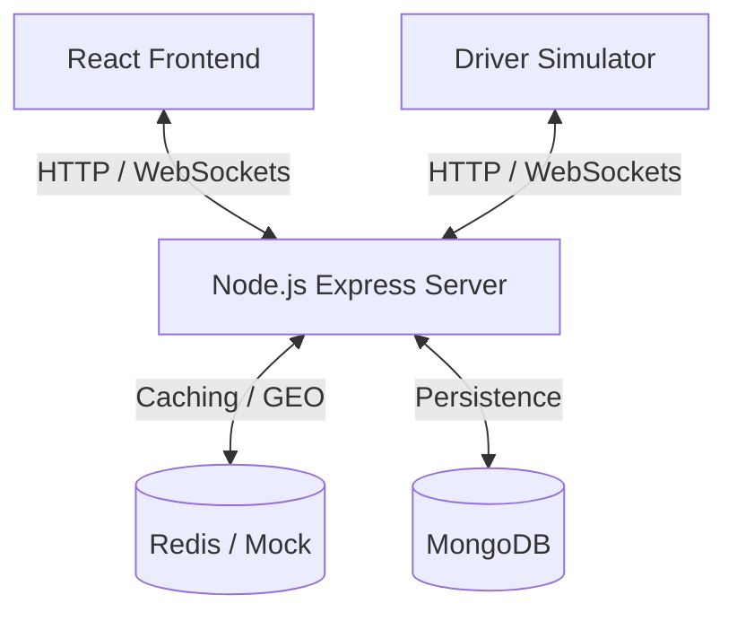

# RideGrid: Real-Time Ride Dispatch & Mobility Platform

RideGrid is a high-performance, real-time mobility and ride dispatch platform designed to coordinate passengers, drivers, and dispatch operations in a concurrent, geospatial environment. 

This repository implements the entire system, separating backend dispatch services, a React-based frontend dashboard, and a multi-agent virtual driver simulator.

---

## Table of Contents
1. [Overview](#overview)
2. [Problem Statement & Purpose](#problem-statement--purpose)
3. [Architecture](#architecture)
4. [Technology Stack](#technology-stack)
5. [Feature List](#feature-list)
6. [Local Setup & Installation](#local-setup--installation)
7. [Environment Variables](#environment-variables)
8. [Docker & Containerization](#docker--containerization)
9. [API Documentation](#api-documentation)
10. [Database Design](#database-design)
11. [Ride State Machine](#ride-state-machine)
12. [Dispatch Algorithm & Geospatial Discovery](#dispatch-algorithm--geospatial-discovery)
13. [Redis & Concurrency Strategy](#redis--concurrency-strategy)
14. [WebSocket Architecture](#websocket-architecture)
15. [Simulation & Load Testing](#simulation--load-testing)
16. [CI/CD Pipeline](#cicd-pipeline)
17. [Security Practices](#security-practices)
18. [Git Workflow](#git-workflow)
19. [Known Limitations & Future Improvements](#known-limitations--future-improvements)

---

## 1. Overview
RideGrid manages real-time paired matches between passengers requesting rides and available driver candidates. It emphasizes resilient database status states, concurrent session safety, live geo-tracking updates, and an automated backend dispatch matching queue.

---

## 2. Problem Statement & Purpose
On-demand ride matching platforms must solve several critical distributed systems issues:
- **Geospatial Proximity**: Finding driver candidates within a specific distance from a passenger pickup location.
- **Exclusivity & Double Bookings**: Preventing two passengers from locking the same driver at the same time (race condition prevention).
- **Graceful Timeouts**: Managing driver responses and falling back/escalating sequentially if the driver rejects or ignores the offer.
- **Status Consistency**: Aligning statuses between memory caches (Redis), persistent storage (MongoDB), and active WebSocket connections.

RideGrid addresses these challenges through a geospatial lookup, atomic Redis key reservation locks, asynchronous state loop resolution, and reactive socket presence mapping.

---

## 3. Architecture

RideGrid uses a modular monolithic architecture, allowing easy containerization:



- **Backend**: Exposes REST APIs for session management, profiles, and rides. Uses a background dispatch process powered by a local Node.EventEmitter for concurrent matching loops.
- **Frontend**: Single Page Application tracking real-time socket events and displaying interactive visual offer dialogs for simulated drivers.
- **Simulator**: Virtual multi-driver daemon mimicking real-world wandering, socket communication, and trip progress milestones.

---

## 4. Technology Stack

- **Frontend**: React, Vite, CSS (Glassmorphism design system), Socket.IO-client.
- **Backend**: Node.js, Express, Socket.IO, Mongoose/MongoDB, Redis (with memory client fallback).
- **DevOps**: Docker, Docker Compose, GitHub Actions.
- **Testing**: Jest, Supertest, k6.

---

## 5. Feature List
- **Secure Authentication**: JWT-based authentication with Access/Refresh token rotation.
- **RBAC Enforcement**: Middleware segregation for `PASSENGER`, `DRIVER`, and `ADMIN` routes.
- **Vehicle Profiles**: Automated checks validating vehicle registration before drivers are allowed online.
- **Geospatial Lookup**: Drivers are indexed in Redis GEO and queried using radius thresholds.
- **Exclusivity Locks**: 15s driver locks utilizing atomic Redis locks to avoid double-bookings.
- **Automated Dispatch Lifecycle**: Sequence-escalating search loop handling timeouts, driver rejections, and passenger cancellations.
- **Real-Time Sockets**: Dynamic presence mapping and private driver rooms for matching.
- **Multi-Driver Simulator**: CLI utility simulating scales up to 1000+ drivers.

---

## 6. Local Setup & Installation

### Prerequisites
- Node.js (v20+)
- MongoDB (running locally or Docker instance)
- Redis (optional, mock fallback active)

### Installation
1. Clone the repository:
   ```bash
   git clone https://github.com/Anvesh-999/RideGrid.git
   cd RideGrid
   ```
2. Set up environment variables (see below).
3. Install dependencies:
   ```bash
   # Server
   cd server && npm install
   # Client
   cd ../client && npm install
   # Simulator
   cd ../simulator && npm install
   ```
4. Launch the services:
   ```bash
   # Start Server (from server directory)
   npm start
   # Start Client (from client directory)
   npm run dev
   # Start Simulator (from simulator directory)
   npm start -- --drivers=10
   ```

---

## 7. Environment Variables

Create a `.env` file in the `server/` directory:
```env
PORT=5000
NODE_ENV=development
MONGODB_URI=mongodb://localhost:27017/ridegrid
REDIS_URL=redis://localhost:6379
JWT_ACCESS_SECRET=your_access_secret_here
JWT_REFRESH_SECRET=your_refresh_secret_here
JWT_ACCESS_EXPIRES_IN=15m
JWT_REFRESH_EXPIRES_IN=7d
DISPATCH_TIMEOUT_SECONDS=15
DISPATCH_RADIUS_KM=2
DISPATCH_MAX_RADIUS_KM=10
DISPATCH_RADIUS_STEP_KM=2
```

---

## 8. Docker & Containerization

Build and start the entire ecosystem (MongoDB, Redis, Server, React Client, Simulator) in one command:
```bash
docker-compose up --build
```
- **React Dashboard**: Accessible at [http://localhost:5173](http://localhost:5173)
- **Backend API**: Running at [http://localhost:5000](http://localhost:5000)

---

## 9. API Documentation

### Auth Endpoints
- `POST /api/auth/register` - Create user.
- `POST /api/auth/login` - Authenticate user, returns tokens.
- `POST /api/auth/refresh` - Refresh access tokens.
- `POST /api/auth/logout` - Invalidate session.

### Drivers & Vehicle
- `GET /api/drivers/me` - Lazy profile initialization.
- `POST /api/drivers/me/vehicle` - Link a vehicle.
- `POST /api/drivers/status` - Go `ONLINE` / `OFFLINE`.

### Rides
- `POST /api/rides` - Passenger requests ride.
- `POST /api/rides/estimate` - Calculate pricing.
- `PATCH /api/rides/:id/status` - Transition trip state (e.g. `SEARCHING`, `DRIVER_ARRIVING`).
- `POST /api/rides/:id/accept` - Driver accepts offer.
- `POST /api/rides/:id/reject` - Driver rejects offer.
- `POST /api/rides/:id/cancel` - Cancel ride.

---

## 10. Database Design

MongoDB collects three core schemas under Mongoose models:
- **User**: Name, email, hashed password, role (`PASSENGER`, `DRIVER`, `ADMIN`), and active refresh tokens.
- **DriverProfile**: References User, tracks availability (`OFFLINE`, `AVAILABLE`, `RESERVED`, `ON_TRIP`), last location, and vehicle ID.
- **Ride**: Coordinates of pickup/destination, fare estimation, statuses, vehicle class, driverId reference, and cancellation timestamps.

---

## 11. Ride State Machine

Rides enforce a strict lifecycle state map. Invalid transitions trigger validation errors.

```
       [REQUESTED] 
            │
            ▼
       [SEARCHING]  ◄───(revert on reject/timeout)──┐
            │                                       │
            ▼                                       │
     [DRIVER_OFFERED] ──────────────────────────────┘
            │
            ▼
     [DRIVER_ASSIGNED]
            │
            ▼
     [DRIVER_ARRIVING] ──► [DRIVER_ARRIVED] ──► [IN_PROGRESS] ──► [COMPLETED]
```
*Note: Rides can transition to `CANCELLED` from any stage prior to `IN_PROGRESS`.*

---

## 12. Dispatch Algorithm & Geospatial Discovery

1. **Trigger**: When a ride transitions to `SEARCHING`, `DispatchEngine.processRide` is triggered in the background.
2. **Lookup**: Employs Redis `GEORADIUS` / `GEOSEARCH` to index all online, available drivers within the search radius of pickup coordinates.
3. **Filtering**: Excludes drivers without sockets, mismatching vehicle classes, or those with existing locks.
4. **Iterative Escalation**: Iterates over eligible drivers sequentially:
   - Sets a 15-second atomic Redis lock.
   - Emits a socket `ride:offer` to the driver's room.
   - If the driver accepts, coordinates assign and loop terminates.
   - If the driver rejects or times out, the lock is cleared and matching moves to the next candidate.
5. **Radius Expansion**: If no candidates are found, the radius expands by steps (up to `DISPATCH_MAX_RADIUS_KM`).
6. **Failure**: If all options are exhausted, the ride transitions to `NO_DRIVER_FOUND`.

---

## 13. Redis & Concurrency Strategy

Exclusivity is guaranteed via atomic operations:
- Set reservation lock:
  ```
  SET driver:reservation:${driverId} ${rideId} NX EX 15
  ```
- The `NX` option ensures that the lock succeeds *only* if the key does not already exist. The `EX 15` ensures auto-release in case of server failures.

---

## 14. WebSocket Architecture

WebSockets establish real-time updates:
- Connection authentication validates JWTs before assigning socket IDs.
- Presence is mapped to routing tables: `userId` maps directly to socket client lists.
- Room segregation: drivers join `driver:room:${userId}` to receive secure matching broadcasts.

---

## 15. Simulation & Load Testing

### Simulator Command Line Actions
The simulation creates real driver load:
```bash
cd simulator
npm run start -- --drivers=250
```
Virtual driver actions are logged to terminal inputs as they progress from wandering to trip completions.

### k6 Load Testing
Ensure k6 is installed locally, boot the local server, and run:
```bash
k6 run server/tests/k6-load.js
```

---

## 16. CI/CD Pipeline
Every pull request and merge to the `main` branch engages a GitHub Actions workflow `.github/workflows/ci.yml`:
- Provisions active MongoDB and Redis container services.
- Installs dependencies and runs all Jest server tests.
- Executes client lint checking and builds the production React assets.

---

## 17. Security Practices
- Hashed passwords using bcrypt.
- Route guarding using authenticated JWT middleware.
- Dynamic cross-origin resource sharing (CORS) limits.
- Prevention of JWT reuse through database Refresh Token Rotation tracking.

---

## 18. Git Workflow
The repository utilizes **Conventional Commits**:
- `feat(...)`: for introducing new features.
- `fix(...)`: for resolving bugs.
- `test(...)`: for adding test cases.
- `docs(...)`: for readme changes.

---

## 19. Known Limitations & Future Improvements
- **Live Maps API**: Mapbox routing maps are simulated using GPS coordinate step interpolation. Future revisions can bind real Mapbox tokens to map paths.
- **Scale Partitioning**: Under extreme scales (10,000+ matches/sec), the automated dispatch engine can be migrated to dedicated background microservices or queues like RabbitMQ.
