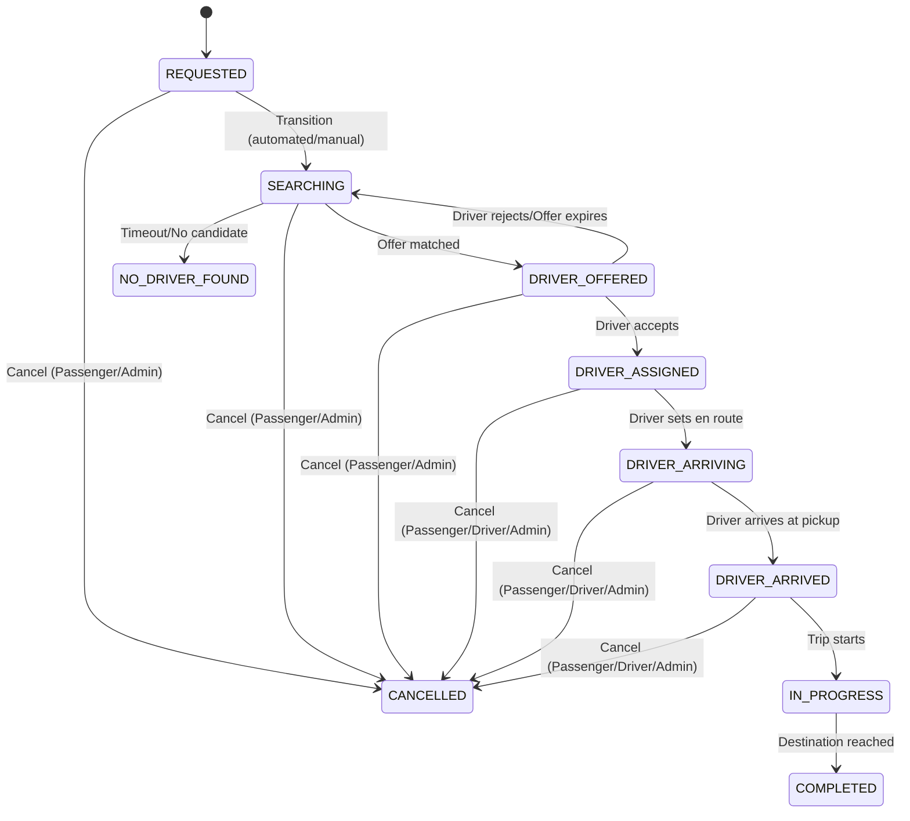

# RideGrid Project Specification

RideGrid is a real-time, concurrent mobility and ride dispatch platform. This document outlines the system architecture, database models, state machines, APIs, and real-time socket communication structures.

---

## 1. System Architecture

The project consists of three main components:
1. **Frontend (React + Vite)**: A premium, dark-mode single-page application (SPA) offering dedicated Passenger and Driver dashboards, preset travel routes, real-time journey simulation, and reactive UI tracking.
2. **Backend (Node.js + Express.js)**: A modular monolithic backend that coordinates database entities, calculates dynamic fares, and processes HTTP and WebSocket requests.
3. **Infrastructure / Storage**:
   - **MongoDB (Mongoose)**: Permanent datastore for users, passenger profiles, driver profiles, vehicles, and ride history.
   - **Redis**: High-frequency memory-cache layer storing driver availability states, detailed coordinates, and geospatial indexes (`drivers:geo`) for nearby driver discovery. Automatically falls back to an in-memory mock client when a live Redis server is unavailable.

```
       [ React Client ] <--- Socket.IO ---> [ Express Server ]
              ^                                   |
              |                                   +---> [ MongoDB ]
              v                                   |
       [ Leaflet/Mapbox ]                         +---> [ Redis / Cache ]
```

---

## 2. Technology Stack

- **Frontend**: React 19, Vite, Javascript (ESModules), Socket.IO Client, Vanilla CSS.
- **Backend**: Node.js, Express, Socket.IO, Mongoose, Redis client.
- **Testing**: Jest, Supertest.
- **Code Quality**: Oxlint (client), ESLint (server).

---

## 3. Database Design

### 3.1. Users Collection (`User`)
Stores authorization credentials, basic user info, and roles:
- `name`: String, required
- `email`: String, unique, required
- `password`: String, required (hashed using bcrypt)
- `role`: String, enum: `['PASSENGER', 'DRIVER', 'ADMIN']`
- `refreshToken`: String (stores current rotation hash)

### 3.2. Passenger Profiles Collection (`PassengerProfile`)
- `userId`: ObjectId (references `User`), required, unique
- `savedLocations`: Array of `{ name: String, address: String, latitude: Number, longitude: Number }`

### 3.3. Driver Profiles Collection (`DriverProfile`)
- `userId`: ObjectId (references `User`), required, unique
- `vehicleId`: ObjectId (references `Vehicle`), optional
- `onlineStatus`: String, enum: `['ONLINE', 'OFFLINE']`, default `'OFFLINE'`
- `availabilityStatus`: String, enum: `['OFFLINE', 'AVAILABLE', 'RESERVED', 'ON_TRIP']`, default `'OFFLINE'`

### 3.4. Vehicles Collection (`Vehicle`)
- `driverId`: ObjectId (references `User`), required
- `licensePlate`: String, required, unique
- `model`: String, required
- `color`: String, required
- `type`: String, enum: `['BIKE', 'AUTO', 'ECONOMY', 'PREMIUM']`, default `'ECONOMY'`

### 3.5. Rides Collection (`Ride`)
- `passengerId`: ObjectId (references `User`), required
- `driverId`: ObjectId (references `User`), optional
- `pickup`: `{ address: String, latitude: Number, longitude: Number }`
- `destination`: `{ address: String, latitude: Number, longitude: Number }`
- `vehicleType`: String, enum: `['BIKE', 'AUTO', 'ECONOMY', 'PREMIUM']`
- `status`: String, enum: `['REQUESTED', 'SEARCHING', 'DRIVER_OFFERED', 'DRIVER_ASSIGNED', 'DRIVER_ARRIVING', 'DRIVER_ARRIVED', 'IN_PROGRESS', 'COMPLETED', 'CANCELLED', 'NO_DRIVER_FOUND']`
- `fare`: Number, required
- `distance`: Number, required (km)
- `duration`: Number, required (minutes)
- `requestedAt`: Date, default `Date.now`
- `assignedAt`: Date
- `arrivedAt`: Date
- `startedAt`: Date
- `completedAt`: Date
- `cancellation`: `{ actor: String, reason: String, timestamp: Date }`

---

## 4. Ride State Machine

Rides follow a strict sequence of valid state transitions. Any invalid transition request is rejected with a `400 Bad Request` containing the error code `INVALID_STATUS_TRANSITION`.



---

## 5. Real-Time Socket.IO Protocol

Websockets facilitate high-frequency updates and bidirectional control flow.

### 5.1. Connection Handshake
Clients must provide a bearer token inside `auth.token`.
The token is decoded on the server. Valid users are joined to:
- A personal room: `user:${userId}`
- A role room if driver: `drivers`

### 5.2. Supported Events
- `driver:location_update` (client to server): Drivers emit coordinates `{ latitude, longitude }`.
  - Stored in Redis Geo Index `drivers:geo`.
  - Cached in Redis key `driver:location:${driverId}` (60s TTL).
  - Broadcast to tracking room `ride:tracking:${driverId}`.
- `ride:location_update` (server to client): Broadcast to passengers tracking active rides.
- `ride:status_changed` (server to client): Emitted to passenger & driver whenever a ride status is transitioned.

---

## 6. Upcoming: Dispatch Engine & Atomic Reservation

The automated matching protocol executes:
1. **Passenger Request**: Creates a Ride document in `REQUESTED` state and transitions it to `SEARCHING`.
2. **Geospatial Discovery**: Finds online and `AVAILABLE` drivers within a 10km radius using Redis GEO index (`drivers:geo`).
3. **Driver Candidate Ranking**: Filters out drivers who do not match the requested `vehicleType` and sorts them by geographic distance.
4. **Atomic Driver Reservation**:
   - Uses Redis to reserve a candidate driver for a short timeout period (e.g. 15 seconds) using atomic operations.
   - Updates the candidate's state in Redis and transitions the driver profile database state.
5. **Ride Offer**: Emits a `ride:offer` Socket.IO event to the reserved driver.
6. **Accept / Reject / Expiration**:
   - **Accept**: Assigns driver to the ride (`DRIVER_ASSIGNED`), cancels reservation timer, and starts the trip lifecycle.
   - **Reject / Timeout**: Cancels the active reservation, resets driver availability, and triggers a retry mechanism targeting the next highest-ranked driver.
   - **If no drivers found/left**: Transitions ride status to `NO_DRIVER_FOUND`.
